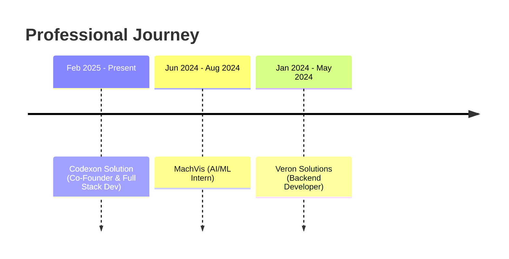

# Labib Kamran

> Full Stack Developer • Cloud Engineer • AI/ML Specialist  
> Co-Founder @ Codexon Solution

[](https://www.labibkamran.com) [](https://linkedin.com/in/labibkamran) [](mailto:labibkamran2003@gmail.com)

---

## 👨‍💻 Overview

```javascript
const developer = {
  education: "BS Computer Science, NUST University",
  experience: {
    years: "2+ development | 1+ professional",
    current: "Co-Founder @ Codexon Solution",
    focus: ["Cloud Infrastructure", "AWS & Kubernetes", "Backend Architecture"]
  },
  location: "Islamabad, Pakistan"
};
```

---

## 🚀 What I Do

| Domain | Technologies | Focus Area |
|--------|-------------|------------|
| **Frontend** | React, Vue.js, JavaScript, TypeScript, TailwindCSS | Modern web interfaces |
| **Backend** | Python, Node.js, Django, Express.js | Scalable APIs & services |
| **Mobile** | Flutter, Java, Kotlin, Android Studio | Cross-platform apps |
| **Database** | PostgreSQL, MySQL, MongoDB | Data architecture |
| **Cloud** | AWS, Google Cloud, Docker, Kubernetes | Infrastructure & deployment |
| **AI/ML** | TensorFlow, PyTorch, Keras, OpenCV | Intelligent systems |

---

## 💼 Experience Timeline



**Codexon Solution** — *Co-Founder & Full Stack Developer*  
Building backend architecture, cloud infrastructure, and DevOps pipelines

**Veron Solutions** — *Backend Developer*  
Developed scalable systems with microservices and automated CI/CD

**MachVis** — *AI/ML Intern*  
Deep learning research and computer vision applications

---

## 📈 GitHub Activity

<div align="center">


</div>

<div align="center">


</div>

---

## 💬 Open for Collaboration

Interested in working together on:
- Cloud-native applications
- Full-stack web projects
- AI/ML integrations
- Open source contributions

**Reach out:** [labibkamran2003@gmail.com](mailto:labibkamran2003@gmail.com)

---

<div align="center">

*Crafting scalable solutions with clean code and modern architecture*

</div>
